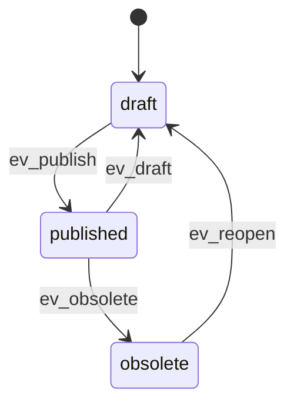
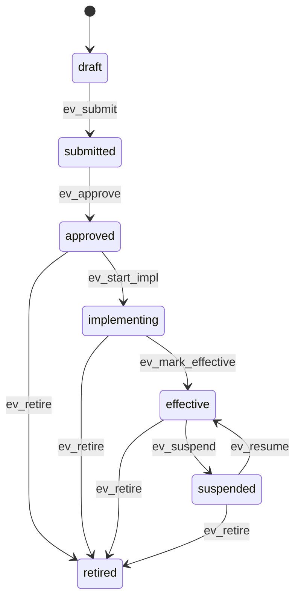

# iTop ISMS Extension

A lightweight Information Security Management (ISMS) extension for **iTop** that adds Assets, Risks, Controls and their relations - including inherent/residual/target risk evaluation, aggregation of control effects, validations, and tidy UI presentations.

> Tested with recent iTop 3.2 lines.

---

## Features

- **Entities**
  - `ISMSAssetType` (typology)
  - `ISMSAsset` (with owner/guardian, dependencies and review dates)
  - `ISMSRisk` (inherent / residual / target, treatment & acceptance)
  - `ISMSControl` (reusable controls with their own lifecycle)
  - Links: `lnkSupportingAssetToAsset`, `lnkISMSRiskToISMSAsset`, `lnkISMSRiskToISMSControl`
- **Risk math**
  - Inherent score = `pre_likelihood × pre_impact`
  - Residual computed from *effective* controls (see aggregation)
  - Target score = `tgt_likelihood × tgt_impact`
  - Level mapping: `low` (<5), `medium` (5–9), `high` (10–15), `extreme` (≥16)
- **Aggregation modes** for control effects
  - `max` (default): take the max reduction per dimension
  - `sum_capped`: sum reductions and cap so residual never goes below 1
  - Per-risk override + global default via config
- **Event-driven logic**
  - Recompute on `EVENT_DB_BEFORE_WRITE`, `EVENT_DB_COMPUTE_VALUES`, `EVENT_DB_LINKS_CHANGED`
  - Attribute flags set via events (computed fields & timestamps are read-only)
  - Dynamic lock of residual dimensions when effective control effects are present
- **Validation (non-blocking warnings)**
  - Mitigation without plan (no effective controls **and** no target)
  - Acceptance without formal acceptance fields
  - Treatment due date in the past
  - Residual worse than inherent
  - Target inconsistencies (partial input, worse than inherent/residual, acceptance conflict)
- **Presentation**
  - Clean 3-column details view with fieldsets
  - "Depends on…" relations for Assets (supporting/supported) and Risks (up: Controls, down: Assets)
- **Localization**
  - Dictionaries in **English** and **German** (EN/DE)

---

## Installation

1. Copy the extension folder (e.g. `br-isms/`) into your iTop `extensions/` directory.
2. (Optional) Add global config (see **Configuration**).
3. Run the iTop setup (web installer or CLI) to update the DB model.
4. Clear cache if needed; log in and assign profiles/rights as appropriate.

---

## Configuration

Global default for risk control aggregation (per-risk can override):

```php
// in config-itop.php
'isms_risk_aggregation_mode' => 'max', // 'max' or 'sum_capped'
```

---

## Data Model (Overview)

### ISMSAssetType

- Typology for Assets (`name`, `description`)
- 1-N back-link to `ISMSAsset`

### ISMSAsset

- Lifecycle: `draft → published → obsolete` (reopen to draft if allowed)
- Key fields: `ref`, `name`, `org_id`, `assetowner_id`, `assetguardian_id`, `category`, `assettype_id`
- Dates: `creation_date` (auto), `publish_date` (on publish), `last_update` (auto), `next_review` (default +1y)
- Relations:
  - `supportingassets_list` / `supportedassets_list` via `lnkSupportingAssetToAsset`
  - `risks_list` via `lnkISMSRiskToISMSAsset`
- Flags:
  - In `published`: identity/context read-only; review dates editable



### ISMSRisk

- Lifecycle: `draft → published → obsolete` (optional reopen to draft)
- Context: `risk_category`, `risk_cause`, `risk_event`, `risk_consequence`, `description`
- Inherent (`pre_*`), Residual (`res_*`), Target (`tgt_*`)
- Treatment: `treatment_decision`, `treatment_owner_id`, `treatment_due`, `treatment_plan`
- Acceptance: `acceptance_status`, `accepted_by_id`, `acceptance_date`, `acceptance_rationale`
- Relations:
  - Controls via `lnkISMSRiskToISMSControl` (only *effective* links contribute to computations)
  - Assets via `lnkISMSRiskToISMSAsset`


### ISMSControl

- Lifecycle (recommended): `draft → submitted → approved → implementing → effective → (suspended ↔ effective) → retired`
- Fields: `name`, `org_id`, `controlowner_id`, `control_domain`, `control_type`, `implementation_date`, `next_review`
- Linked risks via `lnkISMSRiskToISMSControl`
- Can be revised (return to draft) if your policy allows it.



---

## Risk Computation Rules

- **Inherent**
  If both `pre_likelihood` and `pre_impact` > 0
  → `pre_score = pre_likelihood × pre_impact`
  → `pre_level = MapScoreToLevel(pre_score)`

- **Residual**
  - Collect per-link *reductions* (integers) from effective control links:
    - `effect_on_likelihood`, `effect_on_impact`
  - Aggregation:
    - `max` → take max per dimension
    - `sum_capped` → sum and cap so `res_dimension ≥ 1`
  - If any effect is present, set:
    - `res_likelihood = max(1, pre_likelihood − effect_like)` (or `null` if pre is missing)
    - `res_impact    = max(1, pre_impact    − effect_imp)`
  - Always recompute:
    - `res_score` and `res_level` from current `res_*`
  - If **no** effect is present, residual dimensions can be edited manually (UI keeps them writable).

- **Target**
  If both `tgt_likelihood` and `tgt_impact` > 0
  → `tgt_score` & `tgt_level` computed similarly.

- **Level thresholds**
  `extreme` (≥16), `high` (≥10), `medium` (≥5), `low` (<5).

---

## Validations & Warnings (non-blocking)

- Mitigate without effective controls **and** without target: warn
- Accept without `acceptance_status = accepted` or missing `accepted_by` / `acceptance_date`: warn
- Treatment due date in the past: warn
- Residual worse than inherent: warn
- Target: partial input (only one dimension): warn
- Target worse than Inherent or Residual: warn
- Accept + Target below current Residual: warn

(See `EvtCheckToWrite` for the exact messages)

---

## UI/Presentation

- Three columns with clear fieldsets: **Base**, **Context**, **Summary**, **Preliminary**, **Residual**, **Target**, **Treatment**, **Acceptance**, **Dates**.
- Relations:
  - Asset "impacts" shows **supporting/supported** assets and **risks**.
  - Risk "impacts" shows **controls** (up) and **assets** (down).
- Computed fields and timestamps are read-only (via event listeners).

---

## Events & Methods (high level)

- `EvtSetInitialAttributeFlags` / `EvtSetAttributeFlags`
  Enforce read-only on computed fields; dynamic lock of residual values when control effects apply.
- `EvtBeforeWrite` / `EvtComputeValues` / `EvtLinksChanged`
  Recompute scores and touch `last_update`.
- `EvtCheckToWrite`
  Add user warnings for the validations above.
- `DBInsertNoReload` + counters
  Generate human-friendly references:
  - Assets: `A-%04d`
  - Risks:  `R-%04d`

---

## User Rights

This chapter defines who is **Responsible (R)**, **Accountable (A)**, **Consulted (C)**, and **Informed (I)** for key activities within the ISMS extension.

> **Legend:**
> **R** = Responsible (does the work) • **A** = Accountable (final decision/ownership) • **C** = Consulted (two-way) • **I** = Informed (one-way)

### Roles

- **ISMS Manager** – governance & lifecycle authority, full access
- **ISMS Asset Maintainer** – creates/maintains assets
- **ISMS Risk Analyst** – creates/assesses risks, manages risk links & treatment data
- **ISMS Control Maintainer** – creates/maintains controls, implements them (approval/go-live by Manager)
- **ISMS Viewer** – read-only

> Organization scope/visibility is governed separately from these role profiles.

### Typology

| Activity                                   | ISMS Manager | Asset Maintainer | Risk Analyst | Control Maintainer | Viewer |
| ------------------------------------------ | -----------: | ---------------: | -----------: | -----------------: | -----: |
| Maintain **Asset Types** (`ISMSAssetType`) |      **A/R** |                I |            I |                  I |      I |

### Assets

| Activity                                                              | ISMS Manager | Asset Maintainer | Risk Analyst | Control Maintainer | Viewer |
| --------------------------------------------------------------------- | -----------: | ---------------: | -----------: | -----------------: | -----: |
| Create / update **Asset** (`ISMSAsset`)                               |            A |            **R** |            I |                  I |      I |
| Publish asset (→ `published`)                                         |      **A/R** |                I |            I |                  I |      I |
| Obsolete asset (→ `obsolete`)                                         |      **A/R** |                I |            I |                  I |      I |
| Reopen asset (→ `draft`)                                              |      **A/R** |                I |            I |                  I |      I |
| Maintain **supporting/supported** links (`lnkSupportingAssetToAsset`) |            A |            **R** |            C |                  I |      I |

### Risks

| Activity                                                       | ISMS Manager | Asset Maintainer | Risk Analyst | Control Maintainer | Viewer |
| -------------------------------------------------------------- | -----------: | ---------------: | -----------: | -----------------: | -----: |
| Create / update **Risk** (`ISMSRisk`)                          |            A |                I |        **R** |                  I |      I |
| Publish risk (→ `published`)                                   |      **A/R** |                I |            I |                  I |      I |
| Obsolete / reopen risk                                         |      **A/R** |                I |            I |                  I |      I |
| Maintain **Risk ↔ Asset** links (`lnkISMSRiskToISMSAsset`)     |            A |                I |        **R** |                  I |      I |
| Maintain **Risk ↔ Control** links (`lnkISMSRiskToISMSControl`) |            A |                I |        **R** |                  C |      I |
| Define treatment (decision/owner/due/plan, target residual)    |        **A** |                C |        **R** |                  C |      I |
| Record risk **acceptance** (status/by/date/rationale)          |      **A/R** |                I |            C |                  I |      I |

### Controls

| Activity                                    | ISMS Manager | Asset Maintainer | Risk Analyst | Control Maintainer | Viewer |
| ------------------------------------------- | -----------: | ---------------: | -----------: | -----------------: | -----: |
| Create / update **Control** (`ISMSControl`) |            A |                I |            I |              **R** |      I |
| Submit control (→ internal review)          |            A |                I |            I |              **R** |      I |
| Approve control                             |      **A/R** |                I |            I |                  C |      I |
| Start implementation                        |            A |                I |            I |              **R** |      I |
| Mark **effective**                          |      **A/R** |                I |            I |                  C |      I |
| Suspend / resume                            |            A |                I |            I |              **R** |      I |
| Retire                                      |      **A/R** |                I |            I |                  C |      I |

### Notes

- Tables reflect shipped profile permissions: **Manager** can execute all lifecycle stimuli; **Maintainers/Analysts** have day-to-day write access in their domain but not publish/obsolete/approve/effective actions.
- Link maintenance is segregated:
  - Asset topology (`lnkSupportingAssetToAsset`) by **Asset Maintainer**.
  - Risk linkage (`lnkISMSRiskToISMSAsset`, `lnkISMSRiskToISMSControl`) by **Risk Analyst**.
- Organization boundaries (who may touch which org’s data) are enforced via user/org visibility, not via these RACI assignments.

---

## Quick Start

1. Create an **Asset Type** and at least one **Asset**; publish it.
2. Create a **Control**, move it to **effective** (or as your policy requires).
3. Create a **Risk**:
   - Fill **Context** and **Preliminary** (`pre_*`)
   - **Publish** the risk (inherent frozen)
4. Link the effective **Control** to the **Risk** (set link `link_status = effective` and effects).
5. Observe **Residual** values recompute automatically.
6. Set a **Target**; review warnings if inconsistencies exist.
7. Link the **Risk** to relevant **Assets**.

---

## Roadmap / Next steps

- Generalized **Review** objects for Assets, Controls, Risks (with lifecycle and reminders)
- Organization-wide thresholds (e.g., appetite) and dashboards
- Reporting & matrix widgets (risk heatmap)
- Additional control assurance fields

---

## Compatibility & Notes

- Designed for iTop ≥ 3.2
- Time/date parsing uses server timezone for "due date in the past" checks
- Profiles/ACL not included — control via iTop standard mechanisms

---

## Localization

- English and German dictionaries included.
  Add new locales by duplicating the dict files under `dictionaries/`.

---

## Contributing

PRs and issues welcome. Please:

- Follow iTop XML/PHP coding conventions
- Include a short description and testing notes
- Keep dictionaries in EN + DE in sync

---

## License

TBD

---

## Credits

Built with ❤️ for iTop admins who run an ISMS and want a pragmatic, automation-friendly data model without the bloat.
